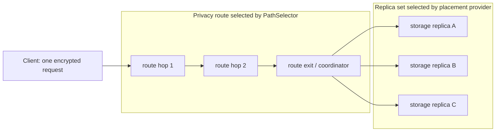

# ADR 0005: storage ownership and replication

- Status: **PROPOSED / NOT-APPROVED**
- Decision owner: **Mr. X**
- Decision deadline: **2026-07-21**
- Approved ADR SHA: **NOT-APPROVED**
- Repository owner proposed for the product runtime: **xnode**
- Scope: design and test-only simulator; no production behavior is changed

## Decision required

Mr. X must either accept this exact ADR SHA or return it for correction. P08, P09A and P09B
must not start from this proposal. Acceptance is recorded by replacing `NOT-APPROVED` with the
approved immutable commit SHA in a later, owner-authored decision record.

## Context

The current `RouterRuntime` selects a three-hop privacy route and forwards the final onion layer to
one `ISessionStorageRpcBackend`. Those three route hops are not three durable storage replicas.
`NodeDbStorageBackend` persists router contacts and heartbeat evidence; it is not a mailbox.
The DevOps storage service is a Session-compatibility runtime and is explicitly not the production
runtime for P09.

P03B provides canonical, domain-separated mailbox capabilities (`MCP1`), replica receipts (`MRR1`),
durable quorum receipts (`MQR1`) and error receipts (`MBE1`). P04 provides signed membership
commitments (`MSM1`) and membership inclusion proofs (`MIP1`). Both packages are contract-only and
retain production blockers. This ADR composes them but does not weaken or activate either contract.

## Options considered

| Option | Client/battery | Trust and failure | Metadata | Operational cost | Decision |
| --- | --- | --- | --- | --- | --- |
| Client fan-out to three replicas | Three requests, three paths and client-side retry/merge; worst mobile radio cost | No single coordinator, but every client must implement quorum and partial-failure logic | Three independently observable deposits correlate timing and size | Complex clients and releases | Rejected |
| XNode core/storage coordinator | Client sends one onion request; one response carries verifiable receipts | Coordinator can censor or omit, but cannot forge two replica signatures; retry through another route is stable | Coordinator sees an opaque stable placement key, ciphertext size and timing | Reuses XNode membership/runtime ownership; bounded internal fan-out | **Recommended** |
| Separate storage sidecar coordinator | One client request | Adds sidecar identity, discovery, link and split-brain failure domains | Router-to-sidecar link adds correlation surface | New deployment, readiness and ownership boundary before evidence justifies it | Rejected for V1 |

## Decision

Use an **XNode-owned core/storage coordinator**. A client sends one onion request. The route exit
coordinates internal replication to `N=3` storage replicas and returns P03B receipts. The client
verifies the two distinct durable replica signatures and coordinator signature. A coordinator is
therefore an availability and metadata trust point, not a durability authenticity root.

The replica backend and coordinator live in the `xnode` product-runtime repository. Recommended
code boundaries are a new `XNode.Storage` assembly for replica durability and
`XNode.Core.Storage` for placement/coordinator abstractions. `deep-devops` owns deployment wiring
and rehearsal only; its compatibility service is not imported as product runtime.

This is an append-only small-envelope mailbox. Attachments, backups and chat-history storage are
out of scope.

## Separate privacy route and storage placement



`RouteHopIds` and `StorageReplicaIds` are different types and are obtained from different
algorithms. A physical XNode may perform both roles, but role overlap is incidental: route
membership never proves storage ownership, and three hops never count as three replicas.

## Placement

### Inputs and trust

- `OpaquePlacementKey`: exactly 32 bytes supplied by the reviewed P07A producer.
- `MembershipEpoch`: the P04 signed membership sequence used to select an immutable verified
  storage roster.
- eligible roster: distinct 16-byte P03B replica receipt IDs, endpoints and receipt-key bindings,
  canonically sorted and committed by the verified P04 membership root;
- protocol version and network ID;
- **not inputs**: request nonce, route hops, raw Session ID, sender/recipient pair, wallet,
  entitlement account or sender master secret.

P05 assumes no derivation mechanism. The key is opaque, and repeated key use remains linkable to
the coordinator and replicas. P07A must define generation-separated production of deposit,
retrieve and placement values without a raw Session ID or sender master-secret assumption.

Temporary health is not membership. A failed owner is not silently replaced by a fourth node
inside the same epoch; `W=2` tolerates one loss. Roster changes require a new signed epoch.

### Algorithm

V1 uses unweighted highest-random-weight (HRW/rendezvous) placement:

```text
score(replica) =
  SHA-256(
    ASCII("deep-storage-placement-hrw-v1") ||
    u16be(placementKey.length) || placementKey ||
    u16be(replicaId.length) || replicaId
  )
owners = first 3 distinct replicas ordered by score descending, replicaId ascending
```

`MembershipEpoch` selects and authenticates the roster and is bound into requests and receipts.
It deliberately does not salt the HRW score: salting each epoch would remap nearly every key and
defeat minimal-remap behavior. Request nonce is used only for transport replay handling and is
never part of ownership.

V1 is unweighted. Capacity heterogeneity is handled by eligibility pools/capacity admission, not
ambient per-request weights. Weighted placement requires a separate version and vectors.

### Required predecessor: P05A storage replication binding contract

P03B `MRR1` has no membership epoch, previous-log commitment, ballot or signed high-water field.
P04 commits membership but does not define the full storage roster leaf. Unsigned JSON cannot fill
those gaps. Before P08, issue **P05A** in `deep-protocol`, owned by the protocol maintainer:

- canonical storage-member leaf and exact P04 `memberCommitment` binding;
- placement commitment and epoch-operation binding to P03B `OperationId`;
- ballot/proposal, previous-commit hash and immutable logical-object/tombstone-target bytes;
- replica-signed high-water evidence and per-record commit-envelope framing around P03B `MQR1`;
- legacy mirror envelope/receipt framing;
- golden, malformed, truncation and cross-language vectors;
- package manifest/hash and independent protocol/security review.

Proposed epoch operation binding:

```text
epochOperationId16 =
  first16(SHA-256(
    "deep-storage-epoch-operation-v1" ||
    networkId16 || u64be(epoch) || membershipStatementHash32 ||
    placementCommitment32 || u64be(generation) || u64be(cursor) ||
    previousCommitHash32 || logicalObjectId16 || operationDigest32
  ))
```

Each replica signs this ID inside P03B `MRR1`. The client recomputes it, verifies `MQR1`, checks the
two receipt IDs against the HRW owners, and verifies the P05A chain/high-water evidence. E and E+1
use different epoch IDs for one logical object. If independent protocol review rejects the
16-byte composition, P05A must introduce a replica-signed wrapper/new receipt version. P08 is only
a pinned XNode consumer; it does not own these protocol bytes.

## Write semantics: `N=3/W=2`

The three owners implement one quorum log per `(placement commitment, epoch, generation)`. Cursor
is a canonical log slot allocated by a quorum protocol; replicas never independently invent it.

1. A coordinator verifies P03B capability/replay state and the pinned P04/P05A roster.
2. It reads signed committed-head and accepted-slot state from a quorum of two exact owners.
3. It runs a per-slot ballot `(counter, coordinatorId16)`. A higher-ballot coordinator must adopt
   an already accepted value according to quorum-intersection rules; it cannot replace it.
4. For a new value, `cursor = committedHead + 1` and `previousCommitHash` is the authenticated head.
   Concurrent coordinators proposing different values for that slot cannot both obtain W2 because
   their write quorums intersect and every replica atomically promises/accepts one ballot/value.
5. Each accepting replica atomically persists proposal, ciphertext/tombstone and dedup state, then
   signs an exact P03B `MRR1` over the P05A-derived operation ID and common cursor.
6. After two distinct exact owners agree, the coordinator creates `MQR1` and finalizes the same
   commit envelope on W2. **Client durable acknowledgement occurs only after W2 stores that final
   certificate**, not merely after two prepare receipts.
7. A later coordinator can complete an accepted W2 value, repair an incomplete owner, or advance a
   higher ballot. A single-owner orphan cannot become a conflicting committed value.
8. Exact retry after an unknown result finds the logical object/operation and returns the original
   certificate. Same idempotency key with different canonical operation bytes is a conflict.

Committed slots form a contiguous hash chain. Cursor zero is invalid; generation never rolls back.
Alternating AB, BC and AC quorums therefore converge on cursors 1, 2 and 3 rather than advancing
three unrelated local cursors.

A tombstone is a new committed slot. Its signed canonical body names exact
`targetLogicalObjectId16`, target generation, target epoch-operation ID and target payload digest.
Its cursor must be greater than the target. Same-slot payload/tombstone disagreement is a fork, not
a dominance tie. TTL expiry is hidden at its signed deadline and is garbage-collected only after a
quorum tombstone/retention checkpoint prevents resurrection.

## Read semantics: `R=2/available-union`

- Query the three owners up to a bound and obtain at least two replica-signed P05A high-water
  statements for one epoch/generation.
- If heads differ, accept a higher head only with a contiguous, per-record certified chain from the
  lower head; repair the stale owner, then obtain two matching high-water statements. With no
  verifiable chain or repair quorum, return `quorum-unavailable`.
- A page carries `pageStart/pageEnd`, two signed high-water statements and one record envelope per
  contiguous cursor. Every record includes ciphertext or canonical tombstone, P03B `MQR1`, exact
  membership/placement binding and previous/current commit hashes.
- The client verifies every record, every chain edge and that successive pages reach the signed
  high-water cursor. One `MQR1` never authenticates an array of unrelated ciphertexts.
- A higher-cursor valid tombstone hides only its signed target. Repair copies commit envelopes and
  cannot reduce a head, alter a target or replace a tombstone with payload.
- Receipts and high-water statements from different epochs never combine to make R2.

## Membership rotation E/E+1

This state machine exists only inside ReplicatedV2. It is not the legacy rollback mechanism.

1. Only adjacent signed epochs overlap, with a finite deadline and at most six physical owners.
2. Dual-read evaluates each epoch independently.
3. A rotation-safe acknowledgement requires independent W2 finalized commit envelopes in both E
   and E+1 and continuous prefixes in both. Any gap marks rotation rollback `NO-GO`.
4. After Mr. X approves E+1 primary and the deadline expires, E writes stop; certificates,
   tombstones and fork evidence remain.

## Product migration LegacySingleExit -> ReplicatedV2

This is a separate state machine:

1. `LegacyPrimary`
2. `ReplicationShadow`
3. `DualRead`
4. `StrictLegacyMirror`
5. `ReplicationPrimaryWithLegacyMirror`
6. `LegacyRetired`

In either mirror state, each candidate v2 acknowledgement requires both:

- a finalized ReplicatedV2 W2 commit envelope; and
- an idempotent `ILegacyRollbackMirror` durable acknowledgement plus read-after-write verification
  for an opaque P05A legacy mirror envelope containing that exact v2 record/certificate.

Legacy rollback retrieves opaque mirror envelopes through the old backend and verifies the embedded
v2 evidence; the legacy server need not understand it. The mirror has a finite deadline, restart
tests and a durable continuity journal. If the current backend cannot supply durable idempotent
store/retrieve semantics, the strict mirror mode is unavailable. A mirror write/read-back failure
means no rollback-safe client acknowledgement; switching to best-effort simultaneously removes the
legacy rollback guarantee. Rollback never resets v2 cursors or deletes receipts/tombstones.

## Quota and charging

- **Logical quota** counts the canonical ciphertext envelope and record overhead once per logical
  object, regardless of `N`, retries, repair or overlap.
- **Physical accounting** records actual bytes written per replica, repair bytes and overlap
  amplification for operator capacity planning.
- One logical quota event is emitted only after the required durable quorum. Exact retries replay
  that event ID and never charge again.
- Tombstone/receipt retention is physical overhead and cannot silently consume a user's logical
  content allowance.
- Free P2P transport remains free. Quota applies only when the user elects to use the managed XNode
  storage infrastructure; self-hosted infrastructure can enforce its own local policy.
- No payer, wallet, plan or stable billing identifier enters placement, mailbox bytes, receipts or
  logs. Entitlements are a later, orthogonal capability decision.

## Mixed versions and legacy flag

The default before P08/P09 is `LegacySingleExit`; no new behavior is active.

Proposed explicit modes:

- `LegacySingleExit`: current single `ISessionStorageRpcBackend`; no replication claim.
- `ReplicationShadow`: compute/observe placement and optionally issue non-authoritative comparison
  metrics; current backend remains authoritative.
- `ReplicationDualRead`: v2 reads are compared while legacy remains authoritative.
- `ReplicationStrictLegacyMirror`: both v2 W2 and verified legacy mirror are required.
- `ReplicationPrimaryWithLegacyMirror`: v2 is authoritative; the same strict legacy mirror gate
  remains until its deadline.
- `ReplicationPrimary`: v2 only after Mr. X retires the legacy mirror.

Modes are operator configuration plus signed membership/protocol eligibility, never ambient
auto-detection. Legacy mirror acceptance additionally requires P03B
`MailboxMixedVersionMarker.LegacyMirrorOverlap`, overlap lifecycle, a finite deadline and explicit
decode-policy opt-in. Downgrade must not delete v2 data or state.

## Failure table

| Scenario | Required behavior | Client-visible result | Repair/rollback consequence |
| --- | --- | --- | --- |
| One replica unavailable | W2 finalization survives on one remaining owner and repairs the other before matching R2 high-water | Success after certified repair | Per-record certificate prevents loss/forgery |
| Alternating AB/BC/AC writes | Quorum ballot/CAS allocates one shared next cursor | Contiguous committed log | No independent local-cursor divergence |
| Concurrent coordinators | Intersecting W2 accepts at most one value per slot/ballot | Loser retries/adopts chosen value | Conflicting committed values are fork evidence |
| Unknown-result retry | Recover chosen value/certificate by logical operation ID | Original cursor/certificate | No duplicate object/quota |
| One stale read | Verify higher contiguous chain, repair stale owner, obtain matching high-water R2 | Complete certified page or retry | Stale owner advances monotonically |
| Omitted record/page | Cursor gap or broken commit hash fails completeness | Retryable `incomplete-prefix` | No unauthenticated available-union |
| Split E/E+1 membership | Evaluate each epoch separately | `epoch-mismatch` or quorum in one complete epoch | Never combine 1+1 receipts |
| Exact retry | Same idempotency key and canonical digest | Cached original result/receipt | No duplicate object or quota |
| Conflicting retry | Same idempotency key, different canonical digest | Non-retryable conflict/evidence | Original durable record remains |
| Coordinator omission/censorship | Client retries through another privacy route | Same replica owners because nonce/route are excluded | Coordinator cannot forge W2 |
| Tombstone | Higher committed slot names exact immutable target | Certified hide/delete | Same-slot conflict is a fork; target cannot change |
| Legacy mirror gap | Do not issue rollback-safe acknowledgement | Retry/fail strict mirror | Best-effort mode removes rollback claim |
| Membership addition/removal | HRW changes only keys touched by new/removed owner | Stable placement for unaffected keys | E/E+1 bounds movement |

## Security and privacy consequences

- Positive: the client performs one radio transaction and verifies independent replica evidence.
- Positive: a malicious coordinator cannot forge two replica signatures or change ownership with a
  nonce.
- Residual: coordinator and replicas observe timing, ciphertext length, stable opaque placement
  value and repeated access. This ADR does not claim traffic-analysis resistance.
- Residual: coordinator censorship remains possible. Retry through a different route improves
  availability, not anonymity against a global observer.
- Required: internal replica transport must be mutually authenticated, bounded and protected from
  SSRF; P04 member proofs bind endpoint/key ownership.
- Required: aggregate metrics have no placement key, raw Session ID, sender/recipient pair,
  capability bytes or receipt ID labels.
- Required: durable atomic P04 LKG/revocation/equivocation state and approved P03B crypto/key
  distribution must exist before activation.

## Evidence from the test-only simulator

The simulator is compiled only into `XNode.Tests`; production projects do not reference it. With
8,192 deterministic placement keys:

| Members | Assignments | Min | Max | Mean | CV | Add-one remap | Expected |
| ---: | ---: | ---: | ---: | ---: | ---: | ---: | ---: |
| 4 | 24,576 | 6,125 | 6,171 | 6,144.00 | 0.0027 | 0.603882 | 0.600000 |
| 20 | 24,576 | 1,187 | 1,265 | 1,228.80 | 0.0163 | 0.144775 | 0.142857 |
| 100 | 24,576 | 209 | 277 | 245.76 | 0.0600 | 0.033325 | 0.029703 |
| 1000 | 24,576 | 10 | 39 | 24.58 | 0.2037 | 0.003296 | 0.002997 |

Tests use separate 32-byte `RouteHopId` and 16-byte `StorageReplicaId` types and pin a binary golden
owner vector. They model nonce independence and add-one remapping at all four sizes, exact-owner
receipt binding, alternating AB/BC/AC prefixes, concurrent stale-head rejection, unknown-result
idempotency, two signed matching high-water statements, contiguous per-record W2 evidence, exact
tombstone targets and E/E+1 continuity-gap rejection.

These tests prove properties of a pure model, not correctness of a production ballot protocol,
disk/network durability, completeness under Byzantine nodes, battery behavior or security.

## Protocol pins

- P03B source: `6e2c709a378ffac40c441e97e2e4da40aac9a104`
- P03B package: `0.3.0-p03b.6e2c709`
- P03B manifest SHA-256:
  `1c820f59033bee6157ecc89c9d7123664f404a6b6a9f5a05703667be5f45f694`
- P04 accepted source: `b887fa088f486390be182cac4cbcb59b60ce8931`
- P04 independent final GO evidence: `db58937`
- P04 package: `0.3.0-p04.b887fa0`
- P04 manifest SHA-256:
  `fd3ef27bf0b9272570d6c6e680a3c99e581f6220799d13ee3afbd86ea0e99298`
- P04 contract identifier: `Deep.Protocol/P04-canonical-v1`

## Consequences

P05A must first implement and independently review the protocol bytes in `deep-protocol`. P08 may
consume its pinned package only after P05/P05A/P04D approval. P09A may then implement one local
replica, followed by P09B coordinator logic. The current single-exit path remains unchanged until
explicit migration gates pass. This proposal creates no Docker service, endpoint, database,
contract, key or production configuration.
