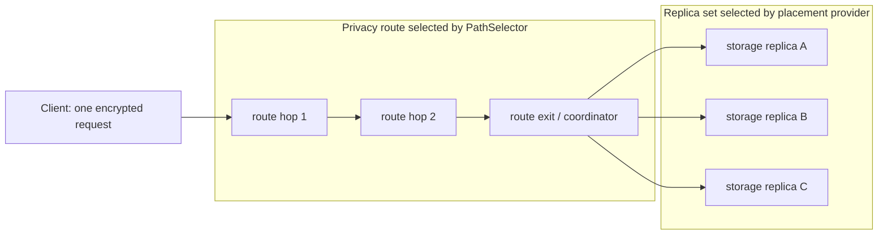

# ADR 0005: storage ownership and replication

- Status: **PROPOSED / NOT-APPROVED**
- Decision owner: **Mr. X**
- Decision deadline: **2026-07-21**
- Approved ADR SHA: **NOT-APPROVED**
- Repository owner proposed for the product runtime: **xnode**
- Scope: design and test-only simulator; no production behavior is changed

## Decision required

Mr. X must either accept this exact ADR SHA or return it for correction. P08, P09A and P09B
must not start from this proposal. Acceptance is recorded by replacing `NOT-APPROVED` with the
approved immutable commit SHA in a later, owner-authored decision record.

## Context

The current `RouterRuntime` selects a three-hop privacy route and forwards the final onion layer to
one `ISessionStorageRpcBackend`. Those three route hops are not three durable storage replicas.
`NodeDbStorageBackend` persists router contacts and heartbeat evidence; it is not a mailbox.
The DevOps storage service is a Session-compatibility runtime and is explicitly not the production
runtime for P09.

P03B provides canonical, domain-separated mailbox capabilities (`MCP1`), replica receipts (`MRR1`),
durable quorum receipts (`MQR1`) and error receipts (`MBE1`). P04 provides signed membership
commitments (`MSM1`) and membership inclusion proofs (`MIP1`). Both packages are contract-only and
retain production blockers. This ADR composes them but does not weaken or activate either contract.

## Options considered

| Option | Client/battery | Trust and failure | Metadata | Operational cost | Decision |
| --- | --- | --- | --- | --- | --- |
| Client fan-out to three replicas | Three requests, three paths and client-side retry/merge; worst mobile radio cost | No single coordinator, but every client must implement quorum and partial-failure logic | Three independently observable deposits correlate timing and size | Complex clients and releases | Rejected |
| XNode core/storage coordinator | Client sends one onion request; one response carries verifiable receipts | Coordinator can censor or omit, but cannot forge two replica signatures; retry through another route is stable | Coordinator sees an opaque stable placement key, ciphertext size and timing | Reuses XNode membership/runtime ownership; bounded internal fan-out | **Recommended** |
| Separate storage sidecar coordinator | One client request | Adds sidecar identity, discovery, link and split-brain failure domains | Router-to-sidecar link adds correlation surface | New deployment, readiness and ownership boundary before evidence justifies it | Rejected for V1 |

## Decision

Use an **XNode-owned core/storage coordinator**. A client sends one onion request. The route exit
coordinates internal replication to `N=3` storage replicas and returns P03B receipts. The client
verifies the two distinct durable replica signatures and coordinator signature. A coordinator is
therefore an availability and metadata trust point, not a durability authenticity root.

The replica backend and coordinator live in the `xnode` product-runtime repository. Recommended
code boundaries are a new `XNode.Storage` assembly for replica durability and
`XNode.Core.Storage` for placement/coordinator abstractions. `deep-devops` owns deployment wiring
and rehearsal only; its compatibility service is not imported as product runtime.

This is an append-only small-envelope mailbox. Attachments, backups and chat-history storage are
out of scope.

## Separate privacy route and storage placement



`RouteHopIds` and `StorageReplicaIds` are different types and are obtained from different
algorithms. A physical XNode may perform both roles, but role overlap is incidental: route
membership never proves storage ownership, and three hops never count as three replicas.

## Placement

### Inputs and trust

- `OpaquePlacementKey`: exactly 32 bytes supplied by the reviewed P07A producer.
- `MembershipEpoch`: the P04 signed membership sequence used to select an immutable verified
  storage roster.
- eligible roster: distinct 16-byte P03B replica receipt IDs, endpoints and receipt-key bindings,
  canonically sorted and committed by the verified P04 membership root;
- protocol version and network ID;
- **not inputs**: request nonce, route hops, raw Session ID, sender/recipient pair, wallet,
  entitlement account or sender master secret.

P05 assumes no derivation mechanism. The key is opaque, and repeated key use remains linkable to
the coordinator and replicas. P07A must define generation-separated production of deposit,
retrieve and placement values without a raw Session ID or sender master-secret assumption.

Temporary health is not membership. A failed owner is not silently replaced by a fourth node
inside the same epoch; `W=2` tolerates one loss. Roster changes require a new signed epoch.

### Algorithm

V1 uses unweighted highest-random-weight (HRW/rendezvous) placement:

```text
score(replica) =
  SHA-256(
    ASCII("deep-storage-placement-hrw-v1") ||
    u16be(placementKey.length) || placementKey ||
    u16be(replicaId.length) || replicaId
  )
owners = first 3 distinct replicas ordered by score descending, replicaId ascending
```

`MembershipEpoch` selects and authenticates the roster and is bound into requests and receipts.
It deliberately does not salt the HRW score: salting each epoch would remap nearly every key and
defeat minimal-remap behavior. Request nonce is used only for transport replay handling and is
never part of ownership.

V1 is unweighted. Capacity heterogeneity is handled by eligibility pools/capacity admission, not
ambient per-request weights. Weighted placement requires a separate version and vectors.

### Binding P03B receipts to P04 placement

P03B `MRR1` does not have a membership-epoch field, and P04 does not redefine receipts. P08/P09
must not claim an epoch-bound quorum from JSON fields alone. Compose the accepted contracts through
the existing P03B 16-byte `OperationId`:

```text
placementCommitment32 =
  SHA-256(ASCII("deep-storage-placement-commit-v1") || placementKey32)

epochOperationId16 =
  first16(SHA-256(
    ASCII("deep-storage-epoch-operation-v1") ||
    networkId16 || u64be(membershipEpoch) || membershipStatementHash32 ||
    placementCommitment32 || logicalOperationId16 || operationDomainByte
  ))
```

Each replica signs `epochOperationId16` inside `MRR1`. The client independently recomputes that
expected ID, verifies `MQR1`, and confirms both distinct receipt IDs belong to the HRW owner set for
the same verified membership snapshot. A dual E/E+1 write uses one logical operation ID but two
different epoch operation IDs. Logical idempotency/quota remains keyed by the logical operation;
replica deduplication is keyed by the epoch operation.

This composition and its golden/cross-language vectors are a P08 prerequisite. If review rejects
the 128-bit operation-ID binding, `deep-protocol` must add an explicit signed placement wrapper or
new receipt version before P09; unsigned DTO fields are not an alternative.

## Write semantics: `N=3/W=2`

1. The coordinator verifies the P03B domain presentation, generation, validity, lifecycle,
   idempotency scope and P04 epoch/roster.
2. It computes the three owners and fans one canonical append operation to those exact owners.
3. A replica atomically deduplicates `(domain, generation, epochOperationId/idempotencyKey)`, advances
   its monotonic cursor, persists ciphertext/TTL/tombstone and only then signs a durable `MRR1`.
4. Accepted-but-not-durable receipts do not count.
5. The coordinator acknowledges durable success only after two distinct HRW owner IDs sign the
   same epoch operation, generation, cursor, tombstone state and payload digest. It returns a
   signed `MQR1`.
6. An exact retry returns the bounded cached outcome. Reusing the idempotency key with different
   canonical bytes is a conflict. The retry nonce cannot move ownership or create a second quota
   event.

The append log orders records by `(generation, cursor, operationId)`. Cursor zero is invalid.
Generation never rolls back. A tombstone is an append and is never an in-place delete.

## Read semantics: `R=2/available-union`

- Request the exact three owners, stop only after two verified matching receipts for a state or
  after the bounded available-union deadline.
- Never combine receipts from different membership epochs to manufacture `R=2`.
- Prefer the highest verified cursor. At the same generation/cursor, any observed tombstone blocks
  returning a payload; two matching tombstone receipts are required for a tombstone quorum.
- One stale plus two matching newer responses returns the newer state and schedules bounded repair.
- One newer plus one stale response is not a quorum and must return a retryable P03B error.
- Read repair is idempotent, rate-limited and cannot reduce generation/cursor or replace a
  tombstone with payload.

## E/E+1 overlap, migration and rollback

Only adjacent epochs may overlap, for a precommitted finite deadline.

1. **New readers**: understand P03B receipts but legacy remains primary.
2. **Dual read**: query E+1 first and E as fallback/reconciliation; quorum is evaluated separately
   per epoch.
3. **Bounded dual write**: write to both E and E+1 owner sets, at most six distinct physical
   replicas. A rollback-capable acknowledgement requires `W=2` independently in both epochs.
4. **Replicated primary**: E+1 is primary after migration evidence; E remains a bounded mirror.
5. **Mirror rollback window**: rollback is permitted only while the E mirror has continuous
   durable-quorum evidence. A gap makes rollback `NO-GO`.
6. **Legacy retirement**: after the signed deadline and Mr. X approval, E writes stop. Receipts,
   tombstones and equivocation evidence remain.

Reads compare verified epoch results by generation/cursor. A higher/equal tombstone dominates a
payload across E/E+1. Rollback cannot reset cursor/generation, delete receipts or resurrect a
payload. Split membership returns a retryable `epoch-mismatch`; receipts from E and E+1 never add
together.

This strict dual-`W=2` rule trades overlap availability for an honest rollback guarantee. A future
policy may make the old mirror best-effort only if it also removes any rollback-safety claim.

## Quota and charging

- **Logical quota** counts the canonical ciphertext envelope and record overhead once per logical
  object, regardless of `N`, retries, repair or overlap.
- **Physical accounting** records actual bytes written per replica, repair bytes and overlap
  amplification for operator capacity planning.
- One logical quota event is emitted only after the required durable quorum. Exact retries replay
  that event ID and never charge again.
- Tombstone/receipt retention is physical overhead and cannot silently consume a user's logical
  content allowance.
- Free P2P transport remains free. Quota applies only when the user elects to use the managed XNode
  storage infrastructure; self-hosted infrastructure can enforce its own local policy.
- No payer, wallet, plan or stable billing identifier enters placement, mailbox bytes, receipts or
  logs. Entitlements are a later, orthogonal capability decision.

## Mixed versions and legacy flag

The default before P08/P09 is `LegacySingleExit`; no new behavior is active.

Proposed explicit modes:

- `LegacySingleExit`: current single `ISessionStorageRpcBackend`; no replication claim.
- `ReplicationShadow`: compute/observe placement and optionally issue non-authoritative comparison
  metrics; current backend remains authoritative.
- `ReplicationDual`: bounded E/E+1 dual read/write with strict rollback evidence.
- `ReplicationPrimary`: P03B `N=3/W=2/R=2` authoritative; legacy mirror only until its deadline.

Modes are operator configuration plus signed membership/protocol eligibility, never ambient
auto-detection. Legacy mirror acceptance additionally requires P03B
`MailboxMixedVersionMarker.LegacyMirrorOverlap`, overlap lifecycle, a finite deadline and explicit
decode-policy opt-in. Downgrade must not delete v2 data or state.

## Failure table

| Scenario | Required behavior | Client-visible result | Repair/rollback consequence |
| --- | --- | --- | --- |
| One replica unavailable | Other two matching durable receipts satisfy W2/R2 | Success with verifiable MQR1 | Repair missing owner when it returns |
| One stale read | Two newer matching receipts win | Newer cursor; repair scheduled | Stale owner advances monotonically |
| Only one newer and one stale | Do not invent quorum | Retryable `quorum-unavailable` | No payload/tombstone downgrade |
| Split E/E+1 membership | Evaluate each epoch separately | `epoch-mismatch` or quorum in one complete epoch | Never combine 1+1 receipts |
| Exact retry | Same idempotency key and canonical digest | Cached original result/receipt | No duplicate object or quota |
| Conflicting retry | Same idempotency key, different canonical digest | Non-retryable conflict/evidence | Original durable record remains |
| Coordinator omission/censorship | Client retries through another privacy route | Same replica owners because nonce/route are excluded | Coordinator cannot forge W2 |
| Tombstone vs payload at same cursor | Tombstone blocks payload; require tombstone R2 | Tombstone quorum or no quorum | Payload cannot resurrect |
| Membership addition/removal | HRW changes only keys touched by new/removed owner | Stable placement for unaffected keys | E/E+1 bounds movement |

## Security and privacy consequences

- Positive: the client performs one radio transaction and verifies independent replica evidence.
- Positive: a malicious coordinator cannot forge two replica signatures or change ownership with a
  nonce.
- Residual: coordinator and replicas observe timing, ciphertext length, stable opaque placement
  value and repeated access. This ADR does not claim traffic-analysis resistance.
- Residual: coordinator censorship remains possible. Retry through a different route improves
  availability, not anonymity against a global observer.
- Required: internal replica transport must be mutually authenticated, bounded and protected from
  SSRF; P04 member proofs bind endpoint/key ownership.
- Required: aggregate metrics have no placement key, raw Session ID, sender/recipient pair,
  capability bytes or receipt ID labels.
- Required: durable atomic P04 LKG/revocation/equivocation state and approved P03B crypto/key
  distribution must exist before activation.

## Evidence from the test-only simulator

The simulator is compiled only into `XNode.Tests`; production projects do not reference it. With
8,192 deterministic placement keys:

| Members | Assignments | Min | Max | Mean | CV | Add-one remap | Expected |
| ---: | ---: | ---: | ---: | ---: | ---: | ---: | ---: |
| 4 | 24,576 | 6,120 | 6,159 | 6,144.00 | 0.0024 | 0.603760 | 0.600000 |
| 20 | 24,576 | 1,180 | 1,289 | 1,228.80 | 0.0256 | 0.142456 | 0.142857 |
| 100 | 24,576 | 216 | 282 | 245.76 | 0.0607 | 0.030029 | 0.029703 |
| 1000 | 24,576 | 9 | 44 | 24.58 | 0.2032 | 0.002930 | 0.002997 |

Tests also prove nonce independence at all four sizes, distinct owners, surviving-owner order on
addition/removal, separate route/replica inputs, one-replica tolerance, stale-read handling,
split-epoch rejection, retry idempotency and tombstone dominance.

These are deterministic design results, not production scale, durability, battery or security
evidence.

## Protocol pins

- P03B source: `6e2c709a378ffac40c441e97e2e4da40aac9a104`
- P03B package: `0.3.0-p03b.6e2c709`
- P03B manifest SHA-256:
  `1c820f59033bee6157ecc89c9d7123664f404a6b6a9f5a05703667be5f45f694`
- P04 accepted source: `b887fa088f486390be182cac4cbcb59b60ce8931`
- P04 independent final GO evidence: `db58937`
- P04 package: `0.3.0-p04.b887fa0`
- P04 manifest SHA-256:
  `fd3ef27bf0b9272570d6c6e680a3c99e581f6220799d13ee3afbd86ea0e99298`
- P04 contract identifier: `Deep.Protocol/P04-canonical-v1`

## Consequences

P08 may implement placement only after approval. P09A may then implement one local durable
replica, followed by P09B coordinator logic. The current single-exit path remains unchanged until
explicit migration gates pass. This proposal creates no Docker service, endpoint, database,
contract, key or production configuration.
